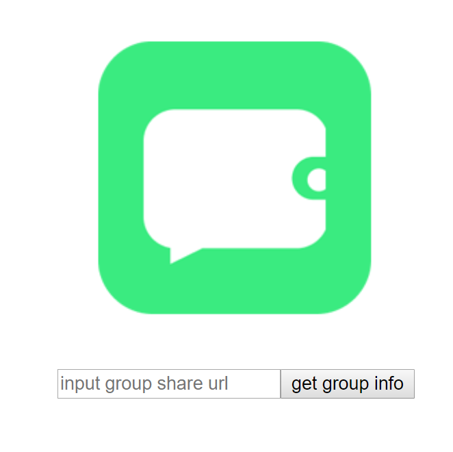
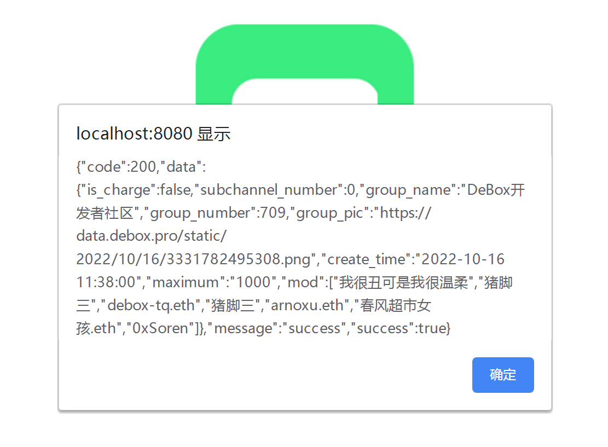

# 一个简单的DeBox API 示例

## 使用Vue来搭建基础工程

### 项目的简单思路说明

1. 修改vue.config.js的proxy；解决跨域问题
2. 创建一个接口，这里使用获取Group信息的接口，并且配置好API-Key 
3. 前端页面中，添加一个输入框，用来接收接口的参数 'group_invite_url'
4. 前端页面中，添加一个按钮，点击调用接口，获取Group信息


### 启动

1. getGroupInfo.js中，替换你自己的API-Key

2. 启动项目
```
npm run serve
```

3. 打开页面后，在输入框输入任意一个Group的分享链接，可以用这个测试 
```
https://debox.space/dao/wC6DlLGJ 
```



4. 输入后， 点击按钮，就会弹出一个面板，显示Group的信息数据



### 欢迎加入官方开发者社区，一起参与生态开发！
 [点击加入](https://debox.space/dao/wC6DlLGJ)


